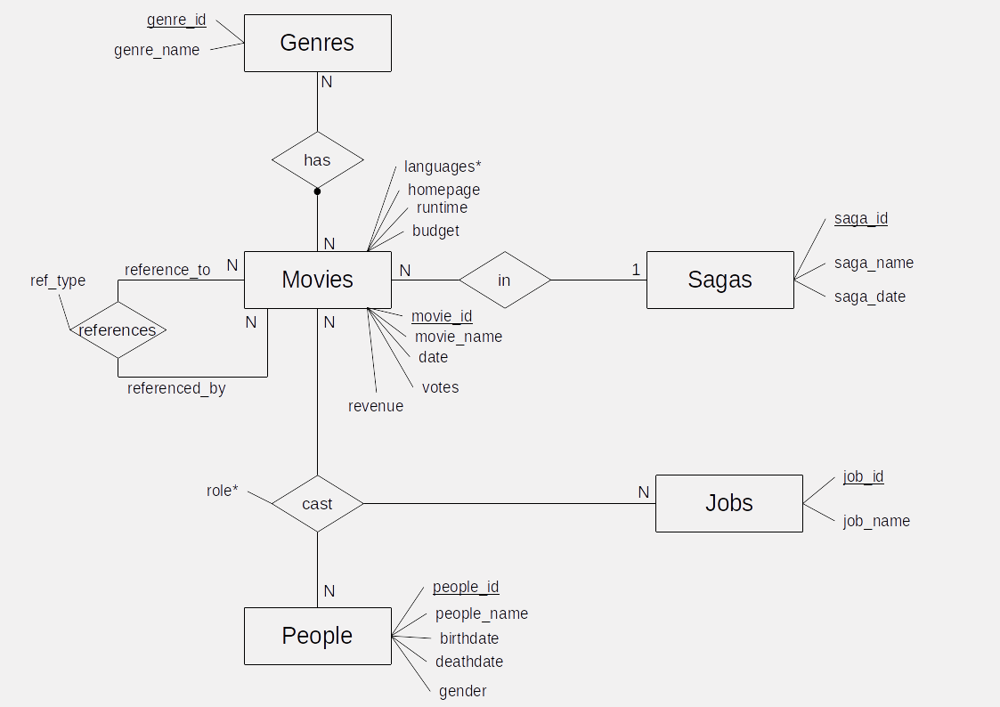

# Challenge Técnico de SQL - Base de Datos de Películas IMDB

Este repositorio contiene un desafío técnico de SQL enfocado en el análisis de una base de datos de películas basada en datos de IMDB.

## 📋 Descripción del Proyecto

**Objetivos principales:**
- Realizar consultas SQL complejas sobre una base de datos PostgreSQL
- Demostrar habilidades en análisis de datos y optimización de consultas
- Trabajar con un esquema relacional real y datos del mundo real

### 🎬 Base de Datos

La base de datos contiene información sobre:
- **Películas**: títulos, fechas de estreno, presupuestos, ingresos, ratings
- **Personas**: actores, directores, productores y sus roles
- **Géneros**: clasificación de películas por género
- **Sagas**: agrupación de películas relacionadas
- **Referencias**: relaciones entre películas (remakes, spin-offs, etc.)

Los datos son un subconjunto real obtenido del sitio [IMDB](https://www.imdb.com).

### 🗂️ Esquema de la Base de Datos



**Entrega esperada:** Completar todas las actividades del notebook, incluyendo consultas SQL, análisis y explicaciones detalladas del trabajo realizado.

## 🚀 Configuración Inicial

### Prerrequisitos

- PostgreSQL instalado localmente
- Python 3.x con Jupyter Notebook
- Bibliotecas Python: `ipython-sql`, `psycopg2`, `ipykernel`

### 📁 Estructura del Proyecto

```
sql-interview/
├── README.md                    # Este archivo
├── preguntas.md                # Preguntas de entrevista técnica SQL
├── logfile                     # Logs de operaciones
└── db/
    ├── challenge.ipynb         # Notebook principal del desafío
    ├── sol.ipynb              # Notebook con soluciones
    ├── figMER.png             # Diagrama Entidad-Relación
    ├── movies_schema.sql      # Script de creación del esquema
    ├── movies_data.sql        # Script de carga de datos
    └── movies_constraints.sql  # Script de restricciones
```

## 🔧 Instalación y Configuración

### 1. Configuración de la Base de Datos

Ejecutar los siguientes comandos en terminal (fuera del notebook) para configurar PostgreSQL:

```bash
# 1. Crear el esquema
psql -U postgres -f db/movies_schema.sql

# 2. Cargar los datos
psql -U postgres -f db/movies_data.sql movies

# 3. Aplicar restricciones
psql -U postgres -f db/movies_constraints.sql movies
```

**⚠️ Nota importante:** Ejecutar estos comandos en una línea de comandos externa para habilitar el modo interactivo y poder ingresar la contraseña cuando sea solicitada.

### 2. Configuración del Entorno Python

```bash
# Instalar dependencias
pip3 install ipykernel ipython-sql psycopg2-binary
```

### 3. Conexión desde Jupyter

En el notebook, utilizar la siguiente cadena de conexión (ajustar según tu configuración):

```python
%sql postgresql://usuario@localhost:5432/movies
```

## 🎯 Cómo Usar Este Proyecto

1. **Abrir el notebook principal**: `db/challenge.ipynb`
2. **Configurar la conexión** a PostgreSQL según tu entorno
3. **Ejecutar las consultas** propuestas en cada sección
4. **Agregar explicaciones** y análisis de los resultados
5. **Consultar** `db/sol.ipynb` para ver ejemplos de soluciones

## 📚 Recursos Adicionales

- **Preguntas de Entrevista**: El archivo `preguntas.md` contiene preguntas técnicas comunes sobre SQL y bases de datos, útiles para preparación de entrevistas
- **Documentación PostgreSQL**: [https://www.postgresql.org/docs/](https://www.postgresql.org/docs/)
- **Datos IMDB**: [https://www.imdb.com/interfaces/](https://www.imdb.com/interfaces/)

## 🎓 Objetivos de Aprendizaje

Al completar este desafío, habrás practicado:

- Consultas SQL complejas con múltiples JOINs
- Funciones de agregación y ventana
- Subconsultas y CTEs (Common Table Expressions)
- Optimización de consultas y análisis de performance
- Modelado de datos relacionales
- Trabajo con datos reales del mundo del entretenimiento

---

**¡Buena suerte con el desafío!** 🍿🎬
